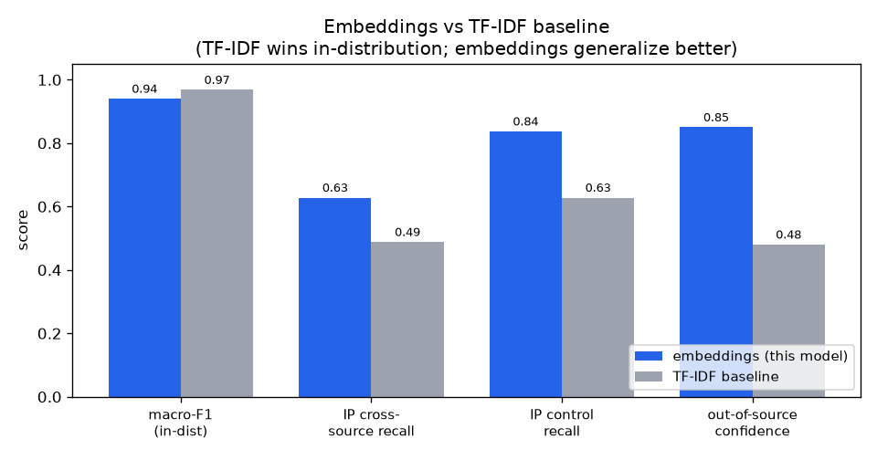

# Document Type Classifier (legal / deal documents)

Classifies an English legal or deal document into one of **nine types** from its text.
It is a logistic-regression head on top of frozen
[`sentence-transformers/all-mpnet-base-v2`](https://huggingface.co/sentence-transformers/all-mpnet-base-v2)
embeddings (the whole document is embedded, by chunking into word windows and mean-pooling).

**Labels:**

- `acquisition_agreement` — M&A / purchase agreements
- `commercial_agreement` — catch-all for "some other contract"
- `constitutional` — charters, bylaws
- `employment_agreement`
- `financial_statements`
- `financing_agreement` — debt instruments, indentures, notes
- `ip_agreement` — licences and IP agreements
- `lease_agreement`
- `nda`

## Results

Held-out test macro-F1 **0.940** (95% CI 0.915–0.963). Compared with a TF-IDF baseline: the
baseline scores higher *in-distribution*, but this model **generalizes better across document
sources**, which is what matters for real use.




> Trained on EDGAR / CUAD / ContractNLI (English, mostly US filings). Generalization to
> other jurisdictions or scanned documents is only lightly tested, and confidence is
> under-calibrated, so set any accept/escalate threshold empirically. Full numbers in
> `metrics.json`.

## Usage

```bash
pip install sentence-transformers scikit-learn skops huggingface_hub numpy
```

```python
import numpy as np, skops.io as sio
from sentence_transformers import SentenceTransformer
from huggingface_hub import hf_hub_download

REPO = "lydongcanh/tectonic-doctype"
encoder = SentenceTransformer("sentence-transformers/all-mpnet-base-v2")   # ~420MB, cached
head = sio.load(hf_hub_download(REPO, "classifier.skops"), trusted=[])

def classify(text: str) -> dict:
    words = text.split()
    chunks = [" ".join(words[i:i+250]) for i in range(0, len(words), 250)][:12] or [""]
    v = encoder.encode(chunks).mean(0)
    v = v / np.linalg.norm(v)
    p = head.predict_proba([v])[0]
    i = int(p.argmax())
    return {"label": head.classes_[i], "confidence": float(p[i])}

print(classify("This Mutual Non-Disclosure Agreement (the “MNDA”) ..."))
# {'label': 'nda', 'confidence': 0.94}
```

## Data & license

Built from openly licensed / public sources; please keep attribution:
**CUAD** (© The Atticus Project, CC BY 4.0), **ContractNLI** (CC BY 4.0), and
**SEC EDGAR** (public US-government records). This derivative model is released under
**CC BY 4.0**.
