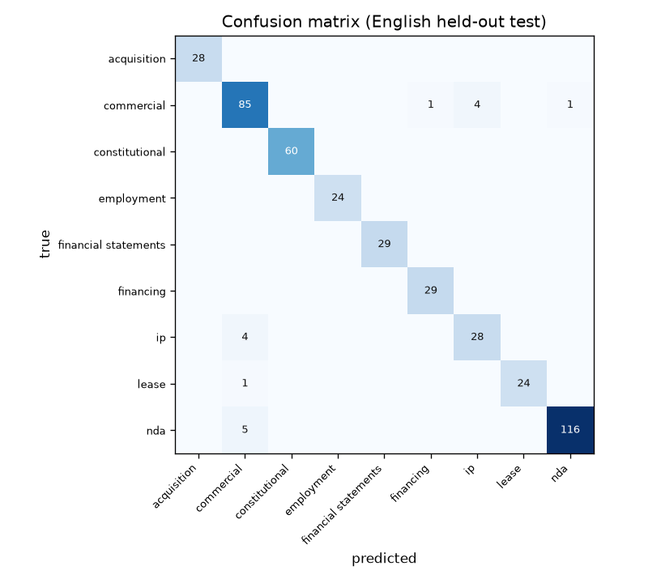

# Document Type Classifier

Classifies a legal / deal document into one of nine types from its text. A
logistic-regression head on frozen [`BAAI/bge-m3`](https://huggingface.co/BAAI/bge-m3)
embeddings, so it is **multilingual** (100+ languages, 8192-token context) and embeds whole
documents.

**Labels:** `acquisition_agreement`, `commercial_agreement`, `constitutional`,
`employment_agreement`, `financial_statements`, `financing_agreement`, `ip_agreement`,
`lease_agreement`, `nda` (`commercial_agreement` is the catch-all for "some other contract").

## Evaluation

**Measured (English held-out test): macro-F1 0.970.** This is the only *labelled* test
set that exists (all training data is English: EDGAR / CUAD / ContractNLI), so it is the only
computed benchmark. Per-class F1:

- `acquisition_agreement`: 1.000
- `commercial_agreement`: 0.914
- `constitutional`: 1.000
- `employment_agreement`: 1.000
- `financial_statements`: 1.000
- `financing_agreement`: 0.983
- `ip_agreement`: 0.875
- `lease_agreement`: 0.980
- `nda`: 0.975



**Other languages: a capability, not a measured result.** The head is trained only on
English, and there is no labelled non-English test set, so a score for other languages cannot
be reported honestly. Other languages work *zero-shot* through bge-m3's shared multilingual
space, which performs well on public multilingual benchmarks but is **unvalidated for this
task**. Treat non-English predictions as usable but unverified. Confidence is not calibrated,
so set any accept/escalate threshold empirically, and note training documents are
US-filing-style, so non-US document structures may differ.

## Usage

```python
import numpy as np, skops.io as sio
from sentence_transformers import SentenceTransformer
from huggingface_hub import hf_hub_download

REPO = "lydongcanh/tectonic-doctype"
enc = SentenceTransformer("BAAI/bge-m3")
enc.max_seq_length = 8192
head = sio.load(hf_hub_download(REPO, "classifier.skops"), trusted=[])

def classify(text: str):
    words = text.split()
    chunks = [" ".join(words[i:i+2000]) for i in range(0, len(words), 2000)][:6] or [""]
    v = enc.encode(chunks).mean(0); v = v / np.linalg.norm(v)
    p = head.predict_proba([v])[0]; i = int(p.argmax())
    return {"label": head.classes_[i], "confidence": float(p[i])}
```

## Data & license

Built from CUAD (© The Atticus Project, CC BY 4.0), ContractNLI (CC BY 4.0), and SEC EDGAR
(public). Released under CC BY 4.0.
